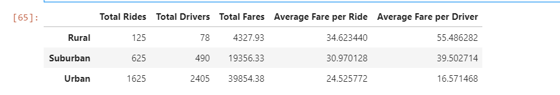
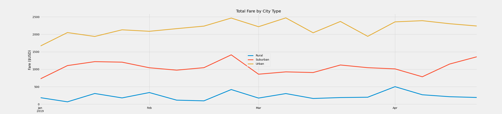

# PyBer_Analysis

## Overview of the Analysis
Created a sumary DataFrame of PyBer by city type. Then using Pandas and Matplotlib, I created a multiple-line graph tha shows the total weekly fares for each city type. By creating this DataFrame it will share insight on how it can be used for the decision-makers at PyBer.

## Results

Below is a snippet of the summary dataframe that i created. The columns are defined as they are created in the order. 

```Python
pyber_summary_df = pd.DataFrame({
          "Total Rides": total_rides_city, 
          "Total Drivers": total_drivers_city, 
          "Total Fares": total_fare_city,
          "Average Fare per Ride": avg_fare_per_ride, 
          "Average Fare per Driver": avg_fare_per_driver})

```
### Pyber Summary 
As a result we got the following table:


From the result above, one observation is that while Ubran had the most rides, it also had more drivers which resulted in drivers gaining less. It could be due to the large number of rides in Ubran area. A small sample size of drivers could not keep up with the demand of rides.


### Line chart Per City type 



Suburban fares from January to mid Febuary were steady, then there was a big spike by the end of Febuary but the last week there was a big dip in fares as well. Rural had the less fares but as seen on the line chart it was the most steady, with a few big spikes in end of Febuary and at the start of April. Urban was consistent through Jan-Mar but then March through April was inconsistent because it went up and down.


## Summary (Three business recommendations)
- Ubran areas could see in an increase of the fare price due to the high demand of riders to compensate the drivers.

- The end of Febuary due to high demand in rides, PyBer could use a surcharge to keep up.

- Ubran drivers can help out in Rural areas where there are less rides but not enough drivers.
